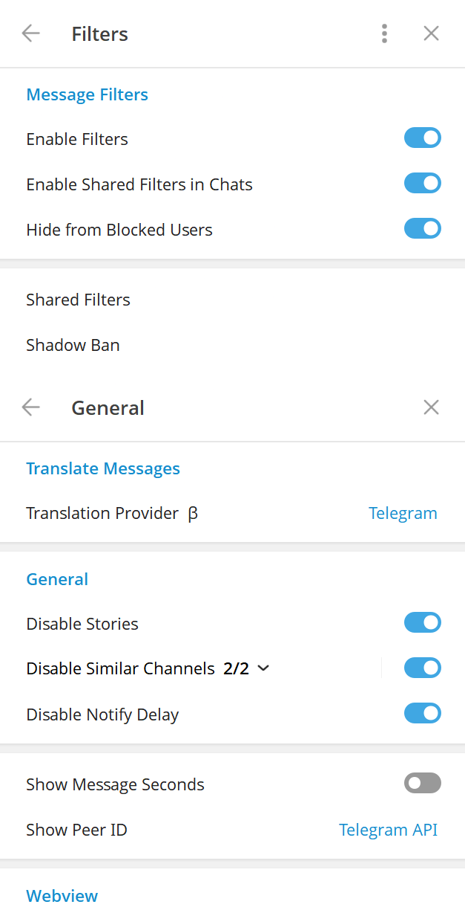

# DiveGram

 

[ [English](README.md)  | Русский ]

## Функции и Фишки

- Полный режим призрака (настраиваемый)
- История удалений и изменений сообщений
- Кастомизация шрифта
- Режим Стримера
- Локальный телеграм премиум
- Переводчик
- Превью медиа и быстрая реакция при сильном нажатии на тачпад (macOS)
- Улучшенный вид

И многое другое. Посмотрите нашу [Документацию](https://docs.divegram.one/desktop/) для более подробной информации.

<h3>
  <details>
    <summary>Превью</summary>
    <table>
      <tr>
        <td></td>
        <td></td>
        <td></td>
      </tr>
      <tr>
        <td></td>
        <td></td>
      </tr>
    </table>
  </details>
</h3>

## Установка

### Windows

#### Официальная версия

Вы можете скачать готовый бинарный файл со вкладки [Releases](https://github.com/DiveGram/DiveGramDesktop/releases) или из
[Телеграм канала](https://t.me/DiveGramReleases).

#### Winget

```bash
winget install RadolynLabs.DiveGramDesktop
```

#### Scoop

```bash
scoop bucket add extras
scoop install divegram
```

#### Сборка вручную

Следуйте [официальному руководству](https://github.com/DiveGram/DiveGramDesktop/blob/dev/docs/building-win-x64.md), если
вы хотите собрать DiveGram сами.

### macOS

#### Официальная версия

Вы можете скачать подписанный пакет со вкладки [Releases](https://github.com/DiveGram/DiveGramDesktop/releases).

#### Homebrew

```bash
brew install --cask divegram
```

### Arch Linux

#### Из исходников (рекомендованный способ)

Установите `divegram-desktop` из [AUR](https://aur.archlinux.org/packages/divegram-desktop).

#### Готовые бинарники

Установите `divegram-desktop-bin` из [AUR](https://aur.archlinux.org/packages/divegram-desktop-bin).

Примечание: данный пакет собирается не нами.

### NixOS

#### Флейк (рекомендуется)

Установите `divegram-desktop` из [ndfined-crp/divegram-desktop](https://github.com/ndfined-crp/divegram-desktop)

#### Nixpkgs

Установите `divegram-desktop` из [nixpkgs](https://search.nixos.org/packages?channel=unstable&show=divegram-desktop)

### ALT Linux

[Sisyphus](https://packages.altlinux.org/en/sisyphus/srpms/divegram-desktop/)

### Gentoo Linux

Инструкцию по установке можно найти в [этом репозитории](https://codeberg.org/OverLessArtem/divegram-ebuild-gentoo).

### Void Linux
Инструкцию по установке можно найти в [этом репозитории](https://codeberg.org/OverLessArtem/divegram-template-void)

### EPM

`epm play divegram`

### Fedora

Из репозитория [RPM Fusion](https://admin.rpmfusion.org/pkgdb/package/free/divegram-desktop/).

```bash
dnf install divegram-desktop
```

### Любой другой Линукс дистрибутив

Flatpak: https://github.com/0FL01/DiveGramDesktop-flatpak

Или следуйте [официальному руководству](https://github.com/DiveGram/DiveGramDesktop/blob/dev/docs/building-linux.md).

## Пожертвования

Вам нравится использовать **DiveGram**? Оставьте нам чаевые!

[Здесь доступные варианты.](https://docs.divegram.one/donate/)

## Использованные материалы

### Телеграм клиенты

- [Telegram Desktop](https://github.com/telegramdesktop/tdesktop)
- [Kotatogram](https://github.com/kotatogram/kotatogram-desktop)
- [64Gram](https://github.com/TDesktop-x64/tdesktop)
- [Forkgram](https://github.com/forkgram/tdesktop)

### Использованные библиотеки

- [JSON for Modern C++](https://github.com/nlohmann/json)
- [SQLite](https://github.com/sqlite/sqlite)
- [sqlite_orm](https://github.com/fnc12/sqlite_orm)

### Иконки

- [Solar Icon Set](https://www.figma.com/community/file/1166831539721848736)

### Боты

- [TelegramDB](https://t.me/tgdatabase) для получения юзернейма по ID (до закрытия бесплатной версии 2 апреля 2026)
